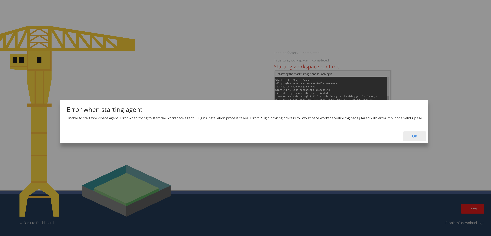
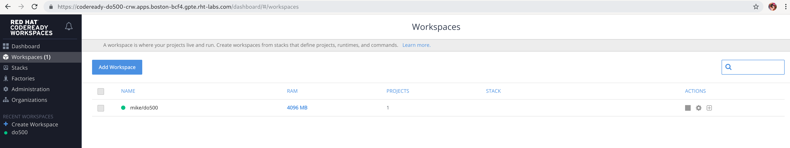
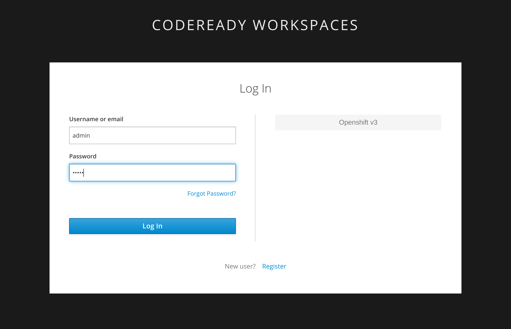
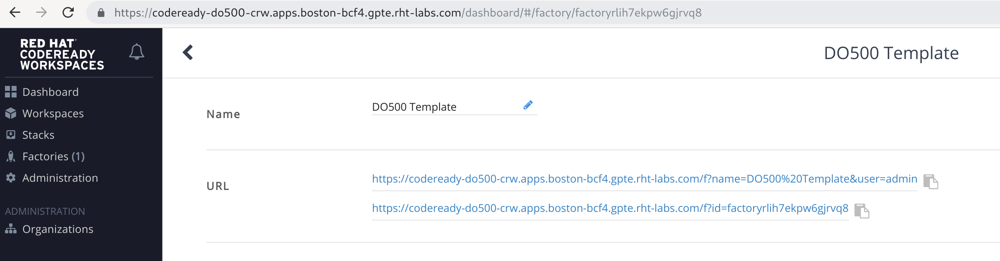

# 🆘 CodeReady Workspaces for Enablement 🆘 HELP FOR THE NEEDY 🆘

Temporary help guide whilst we settle in CRW to enablement. 

Product Documentation

- https://access.redhat.com/documentation/en-us/red_hat_codeready_workspaces/1.2/html-single/administration_guide/index

## Common Errors
> _Provide some guidance for current common issues encountered with CRW and Enablement_
____

### Error Starting Workspace

Users browse to the `factory` URL and see the `not a valid zip` error on starting workspace



- Likely root causes is upstream resolution here - https://github.com/eclipse/che/issues/12762#issuecomment-467797130

<p class="tip">
<b>FIX</b> - Not fatal, the users workspace has been created.

- fix is to just get the user to manually start there created workspace
- browse to dashboard as the user https://codeready-workspaces.apps.<DOMAIN_FOR_YOUR_CLASS>/dashboard
- `Start` the workspace `Actions > triangle start`
</p>



____

### I Have Lost the Magic Factory Link!

Users are asking you for the magic link to create the cloud IDE and the SRE is on a coffee break. From `Excercise.1`

```
https://codeready-workspaces.apps.<DOMAIN_FOR_YOUR_CLASS>/dashboard/#/load-factory?name=DO500%20Template&user=admin
```
<p class="tip">
<b>NOTE</b> - Complete URL should be replaced with the one you've been provided by the instructor.
</p>

<p class="tip">
<b>FIX</b> - Not fatal, use the force. The `factory` is only available to the `admin` user in CRW - hence the `&user=admin` bit on the end of the link (dont change this !).

- Login to dashboard URL (https://codeready-workspaces.apps.<DOMAIN_FOR_YOUR_CLASS>/dashboard) using the admin user (in keycloak/SSO) which is deployed to the CRW namespace
- Browse to `Factories > DO500 Template`
</p>




Longer term we should fix up the admin user creds as well ! - https://github.com/rht-labs/enablement-codereadyworkspaces/issues/17

____

### Multiple workspaces created by users

Not strictly a bug, more a feature, but due to the error starting a workspace, the frantic user has started smashing the Reload button in their browser. Each invocation of the factory link, creates a new workspace - which could make for some fun resource hogging.

<p class="tip">
<b>FIX</b> - Not fatal unless your cluster runs out of resources 🤠

- Ask the users to stop or delete not/in-use workspaces
- browse to dashboard as the user https://codeready-workspaces.apps.<DOMAIN_FOR_YOUR_CLASS>/dashboard
- `Stop` the workspaces not in use `Actions > square stop`
</p>

Longer term we should limit these - https://github.com/rht-labs/enablement-codereadyworkspaces/issues/18

____

### Stuck namespaces that are always 'Terminating' ?

Seems that the Che CR holds onto storage resources (i think).. if you want to delete a projects that is being stubourn

Good Luck 🤠🤠🤠

```
APIURL=https://master.cluster.example.com:443
for i in $( oc get ns | grep Terminating | awk '{print $1}'); do echo $i; oc get ns $i -o json| jq "del(.spec.finalizers[0])"> "$i.json"; curl -k -H "Authorization: Bearer $(oc whoami -t)" -H "Content-Type: application/json" -X PUT --data-binary @"$i.json" "$APIURL/api/v1/namespaces/$i/finalize"; done
for i in $(oc get pvc | grep Terminating| awk '{print $1}'); do oc patch pvc $i --type='json' -p='[{"op": "replace", "path": "/metadata/finalizers", "value":[]}]'; done
for i in $(oc get pv | grep Released| awk '{print $1}'); do oc patch pv $i --type='json' -p='[{"op": "replace", "path": "/metadata/finalizers", "value":[]}]'; done
```
```
oc patch checluster.org.eclipse.che codeready-workspaces -n crw --type='json' -p='[{"op": "replace", "path": "/metadata/finalizers", "value":[]}]'
```

### Who do i call in an emergency?

- 📴 a.team 📴 b.mak 📴